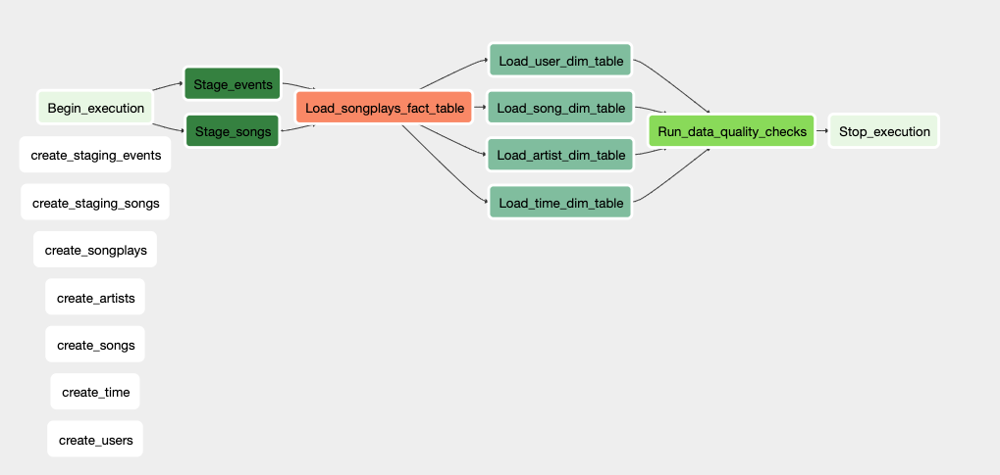

# Airflow Redshift Pipeline

The purpose of this repo is to provide an ETL pipeline in Redshift that is orchestrated and scheduled via Airflow.

The goal is to first create a Redshift database with tables designed to optimize queries on song play analysis.

The data resides in S3, in a directory of JSON logs on user activity on the app, and a directory with JSON metadata on the songs.

The ETL pipeline extracts the data from S3, stages the data in Redshift, and finally transforms it into a set of fact and dimension tables that can be analyzed. The whole pipeline is orchestrated and scheduled via Airflow. 

## Initialise Airflow

Follow the guidelines in [Airflow-Docker](https://github.com/nialloriordan/airflow-docker) repository to initialise Airflow.

## Create Redshift Cluster

- Create an AWS Redshift cluster and save the IAM credentials with access to S3 bucket in AWS. 
- Don't forget to kill the cluster once finished.

## Airflow Connections

In order for Airflow to connect to the database and run the ETL pipeline, you will need to provide your AWS credentials and details for connecting to the Redshift cluster. Information on where the data resides in AWS S3 is configured using the Airflow's module `Variable`.

Open the Airflow UI and click on the Connections tab, where you will create two connections. 

#### **AWS Credentials**

On the Create connection page, enter the following values:

- **Conn Id**: Enter `aws_credentials`.
- **Conn Type**: Enter `Amazon Web Services`.
- **Login**: Enter your **Access key ID** from the IAM User credentials you downloaded earlier.
- **Password**: Enter your **Secret access key** from the IAM User credentials you downloaded earlier.

Once you've entered these values, select **Save and Add Another**. 

#### Redshift Cluster

On the next create connection page, enter the following values:

- **Conn Id**: Enter `redshift`.
- **Conn Type**: Enter `Postgres`.
- **Host**: Enter the endpoint of your Redshift cluster, excluding the port at the end. You can find this by selecting your cluster in the Clusters page of the Amazon Redshift console. Do not include the port at the end of the Redshift endpoint string.
- **Schema**: Enter the redshift schema created when launching the Redshift Cluster. This is the Redshift database you want to connect to. 
- **Login**: Enter your username you created when launching your Redshift cluster.
- **Password**: Enter the password you created when launching your Redshift cluster.
- **Port**: Enter `5439`.

## Airflow DAG

This DAG consists of five main tasks:

1. Create Tables
2. Stage Event Tables
3. Load Fact Table
4. Load Dimension Tables
5. Run Data Quality Checks

Custom operators have been create to optimize processing time. These can befound in the `operators` directory. Helpers class contains all the SQL transformations. 

## Running the DAG

Switch the `dag` to `ON` from the Airflow GUI. The tasks should start running as they are scheduled to every hour and have some backfills to perform. You can inspect the tasks using different Airflow's view such as "Tree View".

Once the Create table tasks are complete, you can check in Redshift for the tables created. The data quality check task ensures that the data load is valid. 

## Structure

- dag.py: file for Airflow dags

- plugins: directory for airflow plugins

  - helpers: helper functions for the SQL transformations
  - operators: Custom Airflow operators

  
